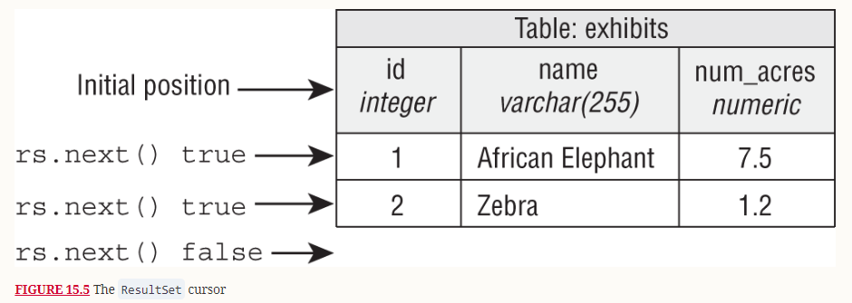

# Laboratorul - 06

### JDBC
- Java Database Connectivity (JDBC) este un API oferit de limbaj care faciliteaza operatiile cu sistemele de baze de date;
- Poate functiona cu orice tip de bd atat timp cat folosim driver-ul corespunzator;
  - Un driver reprezinta implementarea concreta a JDBC API asupra unui tip de baza de date.

### Initializarea unei conexiuni
Se realizeaza cu ajutorul unui URL de conexiune:


In Java clasa **Connection** implementeaza interfata **AutoCloseable** deci poate fi folosita intr-o constrctuie de tipul **try-with-resources**.

### Executarea instructiunilor SQL
Pentru a putea trimite intructiuni SQL avem urmatoarele optiuni:
- **Statement**
- **PreparedStatement**
- **CallableStatement**

#### Statement
Contine functii pentru executarea de instructiuni SQL:
- **executeQuery()** : instructiuni de tipul SELECT;
- **executeUpdate()** : update-uri pe date sau pe structura bazei;
- **execute()** : pentru ambele cazuri de mai sus in cazul in care rezultatul este necunoscut.
  
```
var stmt = con.createStatement()
var sql = "DROP TABLE employees"
stmt.executeUpdate(sql);
```

In cazul in care executam o operatie de SELECT rezultatul este returnat sub forma unui cursor **ResultSet**
```
var selectSql = "SELECT * FROM employees"; 
var resultSet = stmt.executeQuery(selectSql);
```

#### PreparedStatement
PreparedStatement contine interogari SQL precompilate. Acestea pot avea 1 sau mai multi parametrii notati cu `?`.
```
var updatePositionSql = "UPDATE employees SET position=? WHERE emp_id=?";
var pstmt = con.prepareStatement(updatePositionSql);
// setam valorile parametriilor
pstmt.setString(1, "lead developer");
pstmt.setInt(2, 1);
var rowsAffected = pstmt.executeUpdate();
```

#### CallableStatement
CallableStatement permite executarea procedurilor stocate;
```
var preparedSql = "{call insertEmployee(?,?,?,?)}";
var cstmt = con.prepareCall(preparedSql);
// setam valorile parametriilor
cstmt.setString(2, "ana");
cstmt.setString(3, "tester");
cstmt.setDouble(4, 2000);
```

In cazul in care procedura are parametrii de **OUTPUT** acestia trebuie specificati
```
cstmt.registerOutParameter(1, Types.INTEGER);
```

Pentru a obtine rezultatul putem folosii functia **get<type>()**;
```
cstmt.execute();
var new_id = cstmt.getInt(1);
```

#### ResultSet
- Este rezultatul interogarii bazei de date;
- Foloseste metoda **next()** pentru a parcurge randurile returnate;

- In practica acesta este folosit impreuna cu un model (POJO object) pentru a "mapa" rezultatul interogarii la instante ale unui obiect;
```
public class Employee {
    private int id;
    private String name;
    private String position;
    private double salary;
}
```
```
var selectSql = "SELECT * FROM employees"; 
try (var resultSet = stmt.executeQuery(selectSql)) {
    var employees = new ArrayList<Employee>(); 
    while (resultSet.next()) { 
        var emp = new Employee(); 
        emp.setId(resultSet.getInt("emp_id")); 
        emp.setName(resultSet.getString("name")); 
        emp.setPosition(resultSet.getString("position")); 
        emp.setSalary(resultSet.getDouble("salary")); 
        employees.add(emp); 
    }
}
```